# ⚡ Flashcard Quiz App 🎴

A modern, high-performance Android application built to help users learn and memorize facts through
an interactive flashcard system. This project follows the latest industry standards for Android
development, ensuring a smooth, dynamic, and reliable experience.

---

## 🎓 Professor's Deep Dive: How the Code Actually Thinks

### 🧩 Elementary Guide to Coding Terms (For Everyone)

* **`data class` (The Information Box):**  In our code, `FlashcardData` is that box. It always holds
  an ID, a Question, and an Answer.
* **`suspend` (The Polite Waiter):** Imagine a waiter going to the kitchen. Instead of standing
  still and blocking the doorway while the food cooks, they go do other things and come back when
  it's ready. `suspend` tells the app: "This task takes time (like reading from a database), so
  don't freeze the screen while you wait."
* **`interface` (The Menu):** When you go to a restaurant, you see a menu of what they *can* do. You
  don't see *how* they cook it. `FlashcardRepository` is our menu. It says "We can add, delete, and
  show cards."
* **`Flow` (The Water Pipe):** Imagine a pipe from a water tank to your tap. If someone adds more
  water to the tank, it flows through the pipe instantly. Our Database is the tank, and the UI is
  your tap.
* **`sealed class` (The Multi-Choice Quiz):** Imagine a question with only 4 specific answers. You
  can't pick anything else. `QuizEvent` is a sealed class—it tells the app exactly what actions a
  user is allowed to take (Flip, Add, Delete, Next).

---

## 🗺️ The Parameter Journey Map (Where does the data go?)

In coding, we pass "parameters" (information) between files like players passing a ball in a game.
Here is the exact path of every ball:

### 📥 Adding a New Card: The Path of "2+2"

1. **File:** `QuizScreen.kt` ➔ **Component:** `AddCardDialog`
    * **User Action:** You type "2+2" in the `question` box and "4" in the `answer` box.
    * **Ball Starts:** These two **Strings** are the first parameters.
2. **File:** `QuizScreen.kt` ➔ **Function:** `onConfirm`
    * The dialog "throws" the two strings (`q` and `a`) to the `QuizScreen`.
3. **File:** `QuizScreen.kt` ➔ **To ViewModel:** `viewModel.onEvent(QuizEvent.AddCard(q, a))`
    * The strings are wrapped inside a "Message Package" called `AddCard`.
4. **File:** `QuizViewModel.kt` ➔ **Function:** `addCard(question, answer)`
    * The ViewModel opens the package and takes the two strings. It then puts them into a "
      Lunchbox" (`FlashcardData`).
5. **File:** `FlashcardRepository.kt` ➔ **Function:** `addCard(card)`
    * The "Lunchbox" object is passed as a parameter to the Repository.
6. **File:** `FlashCardDao.kt` ➔ **Function:** `insert(card)`
    * Finally, the Repository gives the "Lunchbox" to the Librarian (DAO), who puts it onto the
      Database shelf.

### ✏️ Editing a Card: The Path of the "Updated Lunchbox"

1. **File:** `QuizScreen.kt` ➔ **Component:** `EditCardDialog`
    * **Argument:** The current card is passed *into* the dialog as an **Argument**. This is how the
      dialog knows what to show in the text boxes!
2. **File:** `QuizScreen.kt` ➔ **Function:** `onConfirm`
    * After you edit, a **New Copy** of the `FlashcardData` lunchbox is created using `.copy()`.
3. **File:** `QuizViewModel.kt` ➔ **Function:** `updateCard(updatedCard)`
    * This new lunchbox travels as a parameter through the ViewModel.
4. **File:** `FlashCardDao.kt` ➔ **Function:** `update(card)`
    * The Librarian finds the old card with the same ID and replaces it with your new one.

### 🗑️ Deleting a Card: The Path of "Goodbye"

1. **File:** `FlashcardItem.kt`
    * When you click the Trash icon, the `onDelete` parameter (which is a function) is triggered.
2. **File:** `QuizScreen.kt`
    * The screen receives the signal and asks the ViewModel: `DeleteCard(card)`.
3. **File:** `FlashCardDao.kt`
    * The Librarian uses the `card` parameter to know exactly which row to erase from the phone's
      memory.

---

## 🏗️ The Connection Map (How files talk to each other)

1. **MainActivity** is the **Boss**. It creates the **Database**.
2. The **Database** gives a **DAO** to the **Repository**.
3. The **Repository** is handed to the **ViewModel**.
4. The **ViewModel** is handed to the **QuizScreen**.
5. The **QuizScreen** passes small bits of data to the **Components** (like `FlashcardItem`).

Every file depends on the one before it. This is called **Dependency Injection**, and it's like a
relay race where everyone has exactly what they need to run their part!

---

## 🚀 What is this Project?

The **Flashcard Quiz App** is a digital deck of cards. One side has a **Question**, and the other
has an **Answer**. Users can:

- **View** flashcards in a beautiful, grid-styled interface.
- **Flip** cards to test their knowledge.
- **Create** new cards to customize their learning.
- **Edit** existing cards if they need to update information.
- **Delete** cards they no longer need.
- **Track Progress** via a visual progress bar.

---

## 🛠️ Tech Stack (The "Brain" of the App)

This app uses **Modern Android Development (MAD)** tools:

- **Kotlin**: The primary programming language (Modern, safe, and concise).
- **Jetpack Compose**: A modern toolkit for building the User Interface (UI) with less code.
- **Room Database**: A local storage system that saves your cards forever on your phone.
- **KSP (Kotlin Symbol Processing)**: A fast tool that helps Room generate code behind the scenes.
- **MVVM Architecture**: A professional way to organize code into three parts: Model (Data), View (
  UI), and ViewModel (Logic).
- **Coroutines & Flow**: For handling data smoothly in the background without freezing the screen.

## 📂 Project Structure

```text
com.example.flashcardquiz
├── data/
│   ├── local/          # Local storage (Room Database)
│   ├── model/          # The "Shape" of our data (Flashcard Entity)
│   └── repository/     # The "Middleman" connecting Database to Logic
├── ui/
│   ├── components/     # Small UI pieces (Cards, Backgrounds)
│   ├── screens/        # Full screen layouts (Quiz Screen)
│   └── theme/          # Colors, Fonts, and Styling
└── MainActivity.kt     # The starting point of the app
```

## 🔄 The Flow: How it Works (Beginner Friendly)

Imagine building a house. Here is the order in which we built the app:

### 1. The Foundation: Database & DAO 🏠

- **FlashcardData (Entity):** This is a simple blueprint. It tells the app what a "Card" looks
  like (it has an ID, a Question, and an Answer).
- **FlashCardDao:** Think of this as a **Remote Control**. It has buttons like `insert()`,
  `update()`, and `delete()`. When we press a button, it talks to the database.
- **CardDatabase:** This is the actual **Storage Box** on your phone where the cards are kept.

### 2. The Delivery Truck: Repository 🚚

- **FlashcardRepository:** The DAO is powerful but messy. The Repository wraps it up nicely. It
  takes the data from the "Storage Box" and prepares it to be sent to the UI.

### 3. The Brain: ViewModel 🧠

- **QuizViewModel:** This is where the magic happens. It asks the Repository for cards. It also
  listens for **Events** (like "User clicked Flip") and updates the **State** (the current look of
  the screen).

### 4. The Face: User Interface (UI) 🎨

- **QuizScreen:** This is what you see. It observes the ViewModel. If the ViewModel says "The card
  is now flipped," the Screen automatically updates to show the answer.

---

## 🗝️ Key Concepts Explained (For Beginners)

- **State:** This is a "Snapshot" of the app at one moment. Is the card flipped? Which card is
  showing? State keeps track of this.
- **Events:** These are "Actions" the user takes. Clicking "Next," typing a new question, or
  hitting "Delete" are all events.
- **Flow:** Imagine a water pipe. Data "flows" from the Database, through the ViewModel, and into
  the UI. If the data changes in the pipe, the UI changes instantly.
- **Composable:** These are the building blocks of the UI. `FlashcardItem` is a composable that
  represents a single card.
- **Dependency Injection:** We "pass" the Repository to the ViewModel, and the DAO to the
  Repository. This is like giving a worker the tools they need to do their job.

---

## 🛤️ Data & Parameter Flow (The Map)

Here is how information travels through the app:

1. **User Action:** You click "Add Card" and type "2+2" as the question.
2. **UI (QuizScreen):** Captures your text and sends it as a **Parameter** to
   `viewModel.onEvent(QuizEvent.AddCard("2+2", "4"))`.
3. **ViewModel:** Receives the strings. It creates a new `FlashcardData` object and passes it to
   `repository.addCard(newCard)`.
4. **Repository:** Simply passes that object to the **DAO** (`dao.insert(card)`).
5. **DAO:** Tells the **Room Database** to save this new row of data.
6. **Database:** Saves the data. Because we use **Flow**, the Database then "pushes" the updated
   list of cards back up.
7. **ViewModel:** Automatically sees the new list and updates `uiState`.
8. **UI:** Sees the new `uiState` and draws the new card on your screen. **(Full Circle!)**

---

## 📸 Screenshots

<p align="center">
  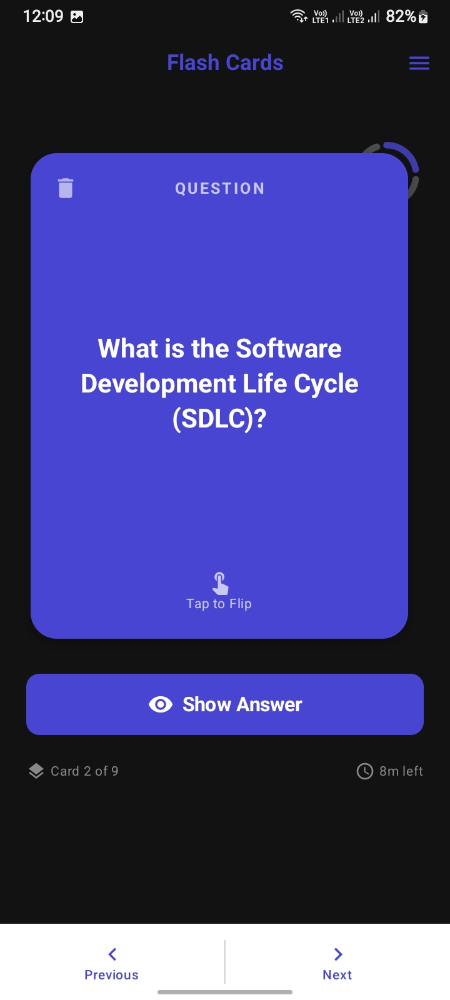
  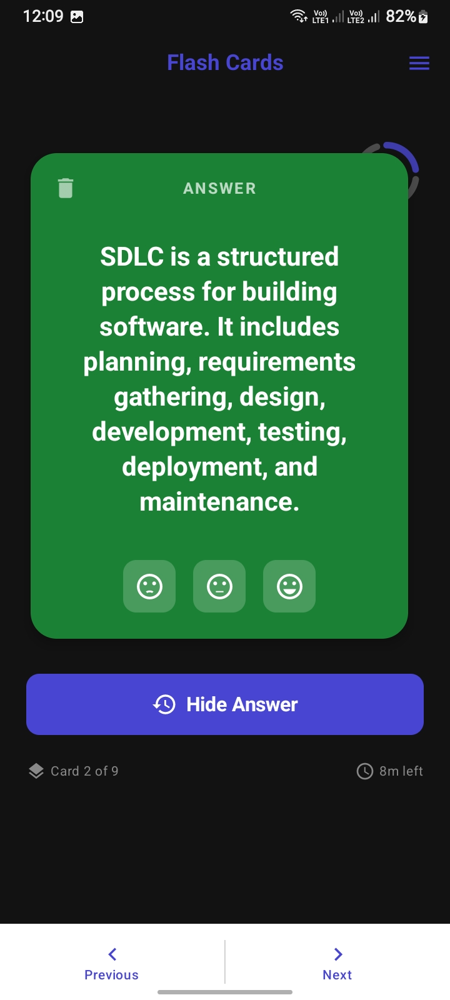
  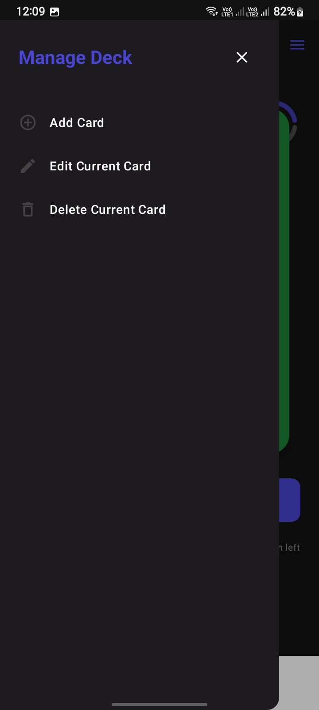
  
</p>
<p align="center">
  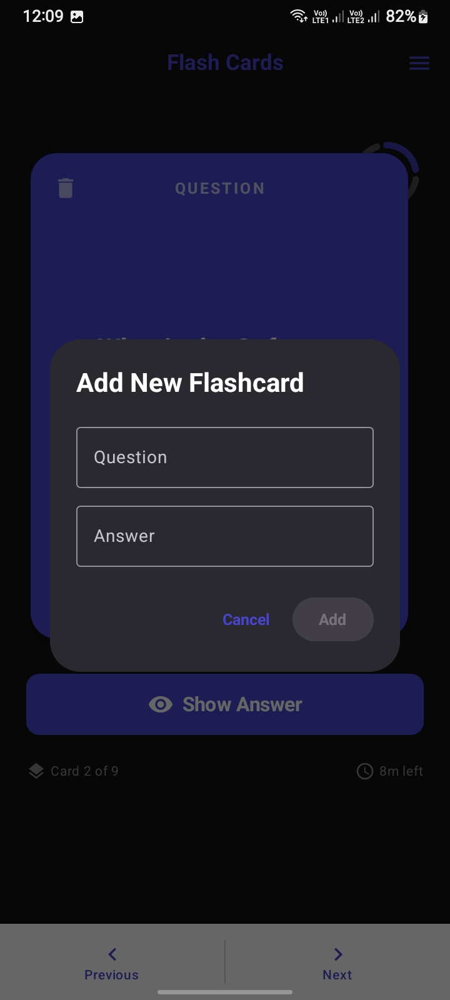
  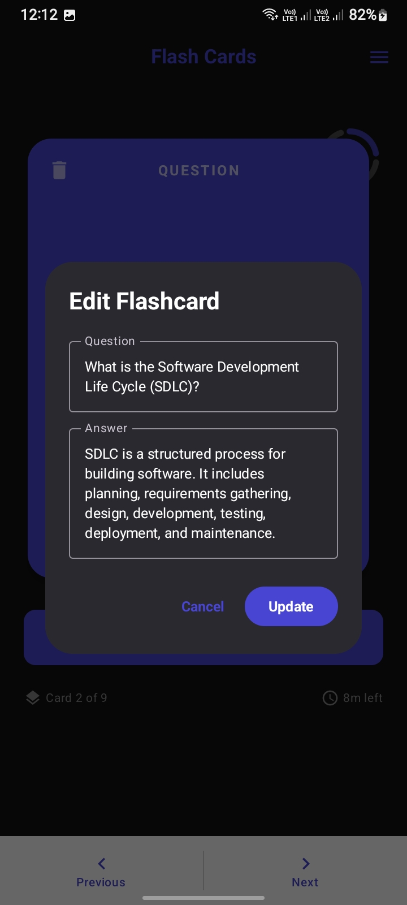
  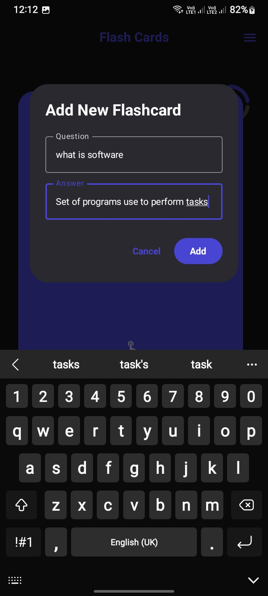
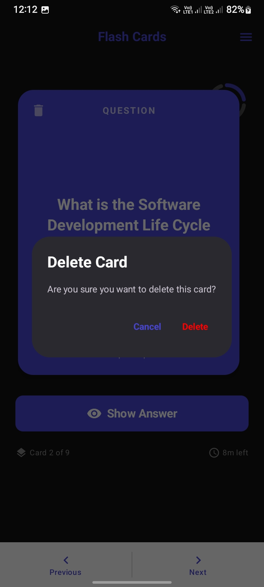

</p>
<p align="center">
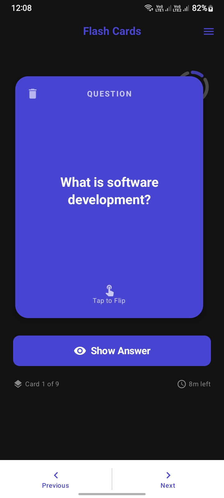
  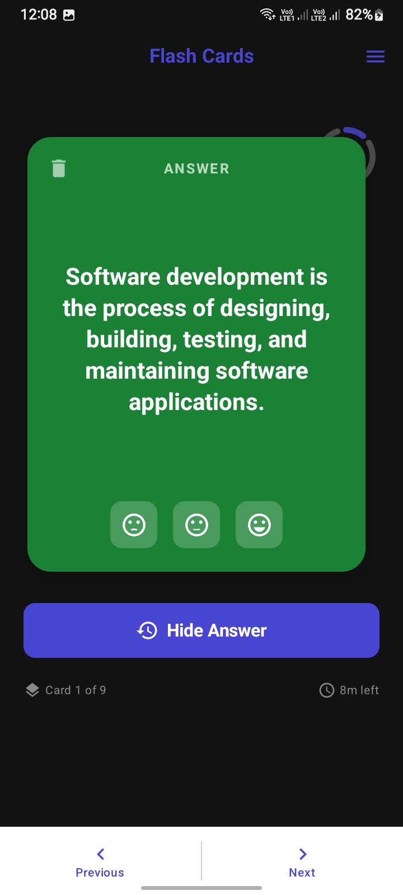
  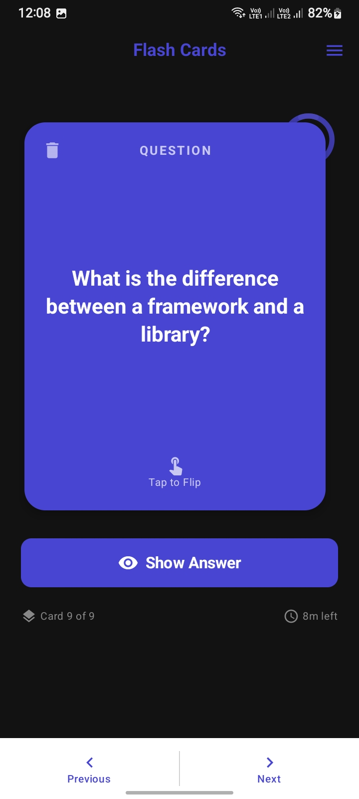
  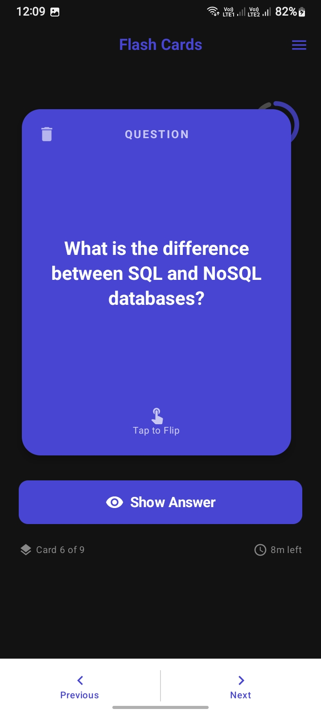
</p>


---

## 🎨 Design Highlights

- **Vibrant Colors:** Uses `PrimaryPurple` and `AnswerGreen` for a professional yet fun look.
- **Responsive Layout:** Cards use `aspectRatio` so they look perfect on small phones and large
  tablets.
- **Smooth Animations:** Flipping a card features a color-fading animation for a premium feel.

---
