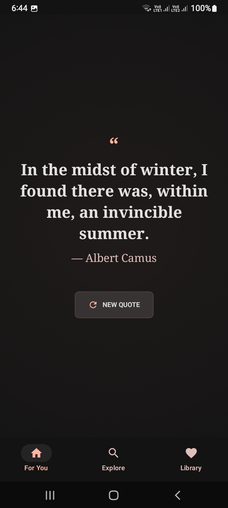
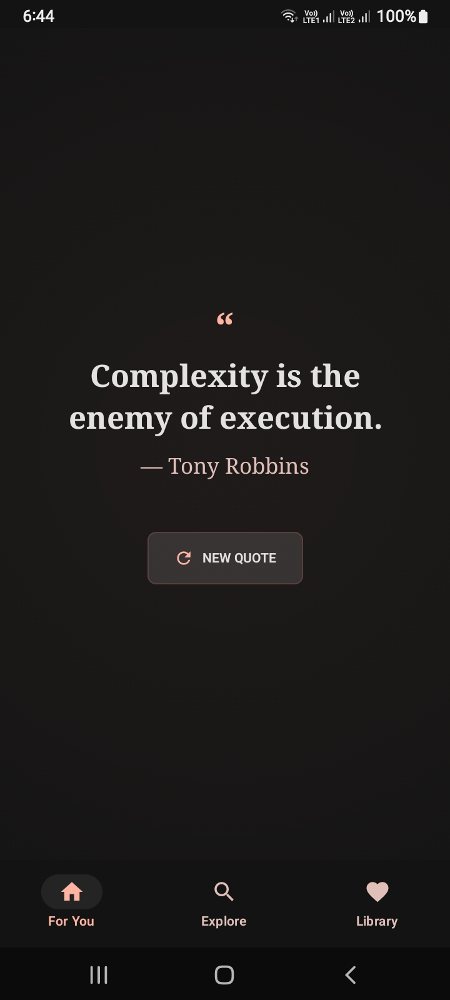
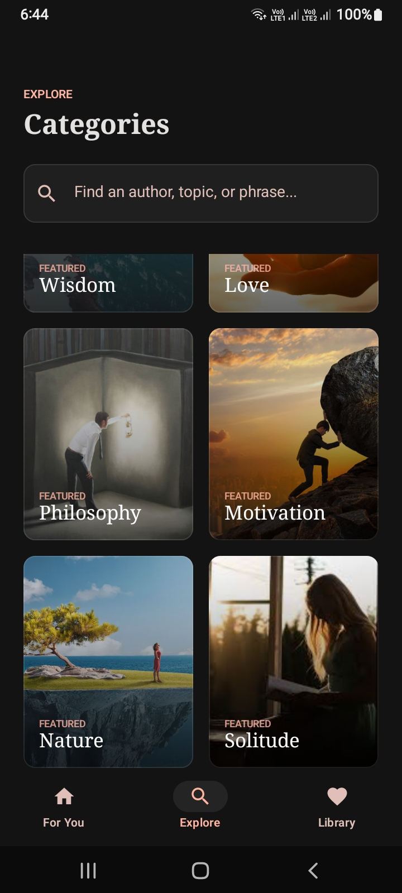
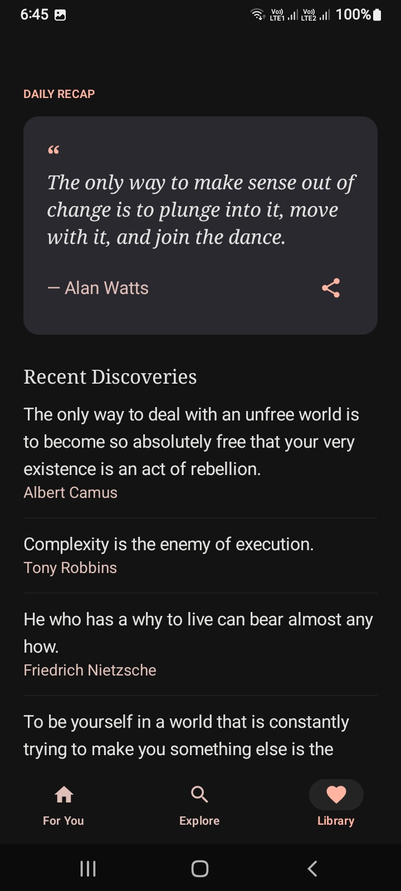

# ✨ Ethereal Wisdom - Random Quote Generator ✨

**Ethereal Wisdom** is a modern, minimalist Android application designed to provide a "digital sanctuary" for thought and inspiration. Built with the **Modern Literary Journal** aesthetic, it combines classical editorial sophistication with contemporary digital minimalism.

---

## 🎯 Purpose & Problem Solved
In a world cluttered with noisy social media, finding a quiet space for reflection is difficult. **Ethereal Wisdom** solves this by:
- Providing a **clutter-free environment** focused solely on meaningful words.
- Offering a **curated experience** through categorized wisdom (Philosophy, Nature, Motivation, etc.).
- Serving as an **inspiration tool** that delivers a fresh perspective with just one tap.

---


## 📸 Screenshots
<p align="center">

  
  
  
  

</p>

---

## 🚀 Key Features
- **📖 For You (Daily Inspiration)**: A beautiful, focused view of a single random quote to start your day.
- **🔍 Explore Categories**: Discover wisdom through specific themes like *Wisdom, Love, Philosophy, Nature, Motivation,* and *Solitude*.
- **📚 Personal Library**: A full collection of quotes presented in a clean, list-based editorial layout.
- **🔄 Instant Refresh**: A haptic-heavy, smooth interaction to generate new quotes on demand.
- **🎨 Glassmorphism UI**: High-quality whitespace, blurred overlays, and soft outlines for a premium feel.
- **📱 Fully Responsive**: Designed to look stunning on every screen size with a fluid grid system.

---

## 🛠 Tech Stack
This project is built using the latest Android development technologies:
- **Language**: [Kotlin](https://kotlinlang.org/) (100%)
- **UI Framework**: [Jetpack Compose](https://developer.android.com/jetpack/compose) (Modern Declarative UI)
- **Navigation**: [Compose Navigation](https://developer.android.com/jetpack/compose/navigation)
- **Design System**: [Material 3](https://m3.material.io/) (Latest Material Design)
- **Architecture**: Clean Architecture / Repository Pattern
- **Typography**: Playfair Display (Serif) & Hanken Grotesk (Sans-Serif)

---

## 📂 Project Structure
```text
com.example.randomquotegenerator
├── 📦 data                # Data Layer
│   └── Models.kt          # Quote data classes & Central Repository
├── 📦 ui                  # UI Layer
│   ├── 📦 screens         # Individual App Screens
│   │   ├── HomeScreen.kt  # Main quote display
│   │   ├── ExploreScreen.kt # Category discovery grid
│   │   └── CollectionScreen.kt # Full list view
│   ├── 📦 theme           # Design System
│   │   ├── Color.kt       # "Ink & Parchment" Palette
│   │   ├── Type.kt        # Editorial Typography
│   │   └── Theme.kt       # Material 3 Theme setup
│   └── Navigation.kt      # Main NavHost & Bottom Navigation
└── MainActivity.kt        # App Entry Point
```

---

## 🔄 Code Flow & Logic
1. **The Entry**: `MainActivity.kt` initializes the app and wraps it in our custom `RandomQuoteGeneratorTheme`.
2. **The Backbone**: `Navigation.kt` manages the screen transitions. It uses a `Scaffold` with a `BottomNavigationBar` to let users switch between Home, Explore, and Library.
3. **The Data Hub**: `QuoteRepository` in `Models.kt` acts as the "Single Source of Truth." It manages all quotes and category data.
4. **State Management**: 
   - In **Home**, `remember { mutableStateOf(...) }` is used to instantly update the UI when a user requests a "New Quote".
   - In **Explore**, clicking a category passes a `String` argument via Navigation to filter the Library view.
5. **UI Rendering**: Every screen uses **Jetpack Compose** components like `LazyVerticalGrid` and `LazyColumn` to ensure high performance and smooth scrolling.


---

## 🎨 Design Principles Covered
- ✅ **Fluid Grid System**: 32dp outer margins for an "airy" feel.
- ✅ **Tonal Layering**: Depth achieved through different shades of Charcoal rather than heavy shadows.
- ✅ **Glassmorphism**: 12% opacity overlays with 20px backdrop blur.
- ✅ **Modern Minimalism**: Prioritizing legibility as the primary "hero" of the interface.


